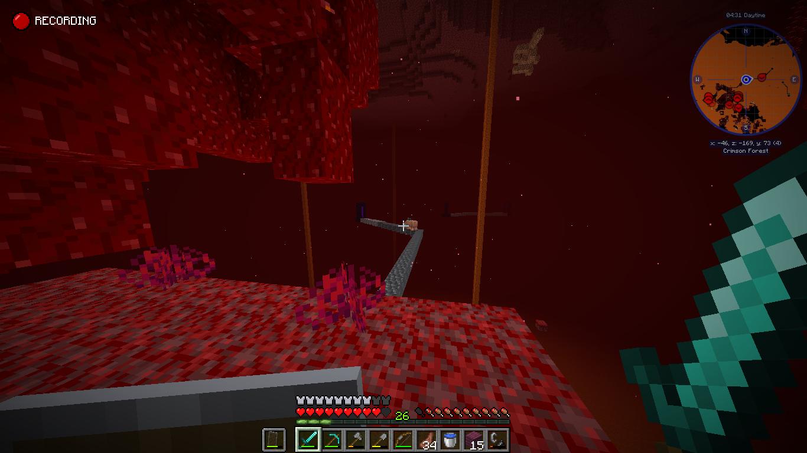

# Minecraft_HP_detection
画像の特定のピクセルを拾ってきて、赤なら「ハートがある」と定義、黒なら「ハートが無い」と定義<br>
ハート10個分の座標を拾ってきて、条件分岐させることで1~10個のハート検知を実現<br><br>

フォルダ内のheart1, heart9の画像それぞれで実行させると、それぞれの画像内のハートの個数に応じた結果が出力される。

### ※本プログラムは特定の解像度のマイクラ画像にしか対応していない。解像度が異なると狙い通り動かないので注意
<br>


```
ハート1個
```

<br><br>

```
ハート9個
```
